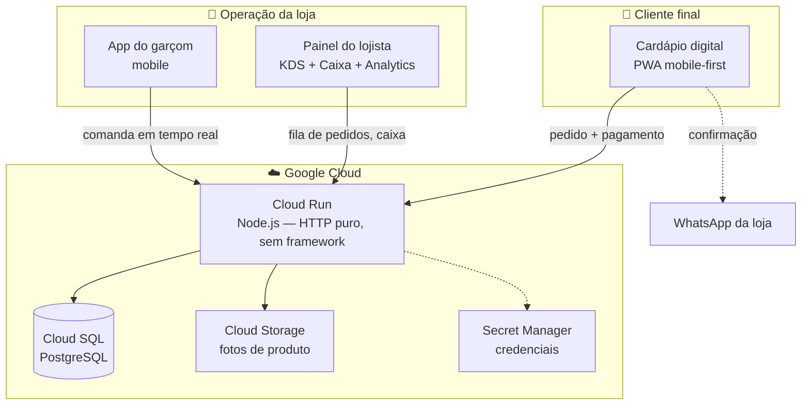

# 🔥 BarFlow Cloud

**SaaS multi-tenant de gestão para bares e restaurantes** — cardápio digital, comanda de garçom, KDS de cozinha em tempo real, caixa/fechamento contábil e painel de dono, tudo rodando na nuvem.

Construído **sozinho, do zero à produção real, em 3 dias** (28 a 30 de agosto de 2026) — com um cliente pagante de verdade usando o sistema no dia a dia do próprio restaurante, dinheiro de cliente real passando pelo caixa.

> 💡 Este repositório é uma vitrine curada do projeto (case study + trechos de código representativos). O código-fonte completo é privado por conter dados de um cliente real em produção.

---

## 🧭 O problema

Bares e restaurantes pequenos no Brasil geralmente usam papel, WhatsApp e planilha pra controlar pedido, mesa e caixa — ou pagam caro por sistemas engessados feitos pra rede grande. O BarFlow Cloud é um sistema operacional completo pro dia a dia de um restaurante: o cliente pede pelo celular, o garçom lança na mesa, a cozinha vê em tempo real, e o dono fecha o caixa no fim do dia sabendo exatamente quanto entrou e de que forma.

## 🏗️ Arquitetura

Um único serviço Node.js (servidor HTTP nativo, sem Express) atende três frontends diferentes — cardápio público, app do garçom e painel do lojista — todos multi-tenant sobre a mesma base PostgreSQL, isolados por `loja_id` em toda consulta.

## 🛠️ Stack

| Camada | Tecnologia |
|---|---|
| Backend | Node.js (`http` nativo — sem Express/Fastify) |
| Banco | PostgreSQL (Google Cloud SQL) |
| Frontend | JavaScript puro, mobile-first, sem framework (React/Vue) |
| Infra | Google Cloud Run, Cloud Storage, Secret Manager, Artifact Registry |
| Testes | `node --test` nativo, Postgres real descartável via Docker |
| Deploy | Docker + `gcloud run deploy`, zero downtime |

## ✨ Funcionalidades

- **Cardápio digital público** com carrinho, adicionais por item, opção obrigatória configurável (ex: tipo de queijo) e integração com WhatsApp
- **App do garçom** (mobile-first) pra lançar pedido direto na mesa, com senha de gerente pra qualquer cancelamento
- **KDS (Kitchen Display System)** em tempo real — pedido aparece na cozinha assim que é feito, item que não precisa de preparo (bebida) não trava a fila
- **Caixa do dia**: abertura com troco inicial, suprimento/sangria, fechamento com conferência, bloqueio contra abrir/fechar duas vezes no mesmo dia
- **"Meus Pedidos"**: cliente final "loga" só com o telefone (sem senha) e vê o histórico de pedidos daquela loja, com "pedir de novo"
- **Painel de analytics**: faturamento, ticket médio, ranking de produtos, formas de pagamento
- **Painel SuperAdmin** (dono do SaaS): visão de todos os clientes, MRR, bloqueio por inadimplência

## 🧩 Desafios de engenharia resolvidos

Uma seleção de problemas reais encontrados construindo e operando o sistema — não é só "fiz um CRUD":

- **Isolamento multi-tenant testado com ataque real**: em vez de confiar só em revisão de código, escrevi um teste que loga como o Cliente A e tenta *de propósito* ler/editar/apagar dado do Cliente B em cada rota do sistema (cardápio, pedidos, caixa, analytics). Ver [`excerpts/multiTenantIsolation.test.js`](excerpts/multiTenantIsolation.test.js).
- **Corrupção de dado em produção causada por um `ON CONFLICT DO NOTHING` sem `UNIQUE` constraint por trás** — Postgres aceita a sintaxe sem reclamar, mas ela vira no-op silencioso sem a constraint certa. Cada deploy duplicava o estoque padrão. Corrigido com deduplicação + constraint real, sem downtime.
- **Fuso horário Brasil vs. UTC**: o "dia de operação" do caixa (pra fechar às 6h da manhã, não à meia-noite) misturava hora local do processo com data UTC do banco — o corte do dia acontecia 3h mais cedo do que o dono esperava. Ver [`excerpts/caixaService.js`](excerpts/caixaService.js).
- **Rate-limit dedicado por rota, não genérico**: a rota pública de histórico do cliente usa um limitador *separado* do de login — porque o Wi-Fi de uma loja física faz NAT (todo cliente sai com o mesmo IP público), e usar o mesmo limitador do login arriscaria bloquear o dono do restaurante por causa do tráfego de clientes. Ver [`excerpts/rateLimit.js`](excerpts/rateLimit.js).
- **Debugging de integração com WhatsApp em produção**: um bug que só se manifestava no app nativo do celular (nunca no navegador de teste) — a causa real era um redirecionamento programático perdendo o "gesto do usuário" exigido pelo sistema operacional pra abrir outro app; a correção final foi trocar por um botão de verdade pro cliente tocar.

## 🧪 Testes

Suíte com **54 testes automatizados** (`node --test`, sem framework externo), cobrindo autenticação e rate-limit, CRUD de cardápio, pedidos públicos com idempotência, segurança de preço (servidor nunca confia no valor que o cliente manda), caixa, analytics, isolamento multi-tenant e restrição de rede. Roda contra um Postgres real descartável (Docker), nunca contra produção.

## 📅 Linha do tempo real (28–30 de agosto de 2026)

| Dia | Entregas |
|---|---|
| **Dia 1** | Setup multi-tenant, autenticação, cardápio + upload de fotos com deduplicação, domínio próprio |
| **Dia 2** | Comanda de garçom, mesas, KDS em tempo real, caixa/fechamento contábil, analytics |
| **Dia 3** | Auditoria de segurança completa (corrigidos: credencial exposta, XSS armazenado), isolamento multi-tenant testado com ataque real, suíte de 54 testes, colocado no ar pro primeiro cliente pagante |

## 👤 Sobre o autor

**Idarlan Magalhães** — desenvolvedor focado em IA, visão computacional e automação, atualmente em Residência Tecnológica em IA (SiDi/Softex).

- GitHub: [github.com/idarlandias](https://github.com/idarlandias)
- LinkedIn: [linkedin.com/in/idarlandias](https://www.linkedin.com/in/idarlandias/)
