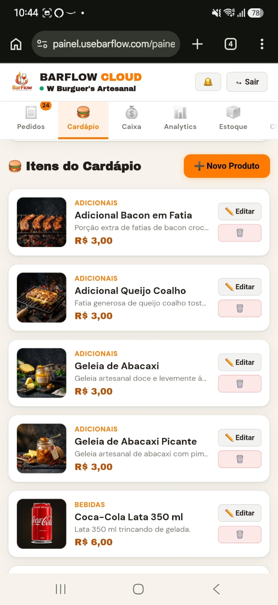
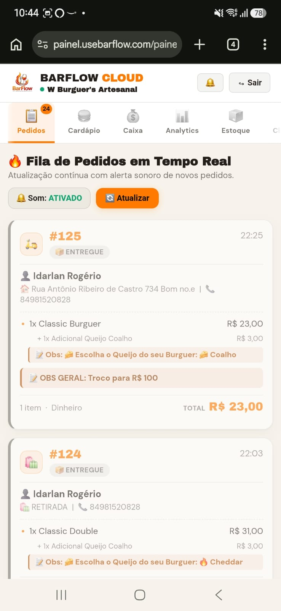
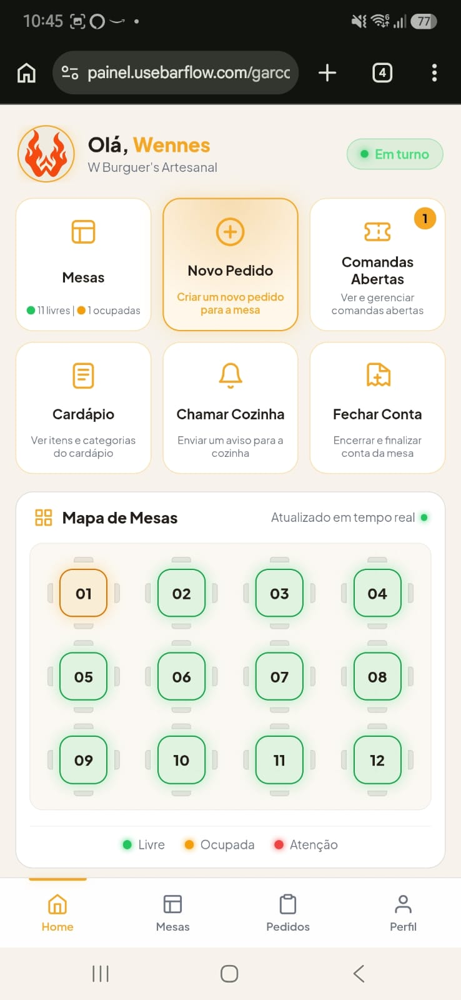
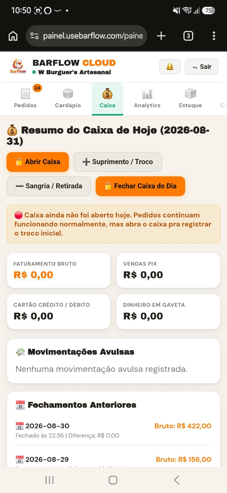
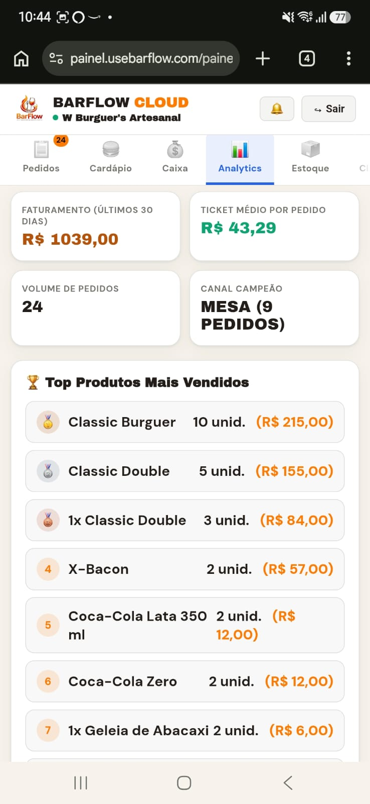
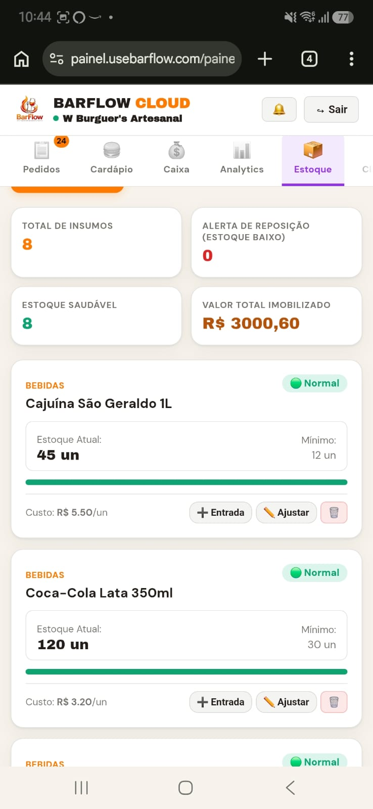
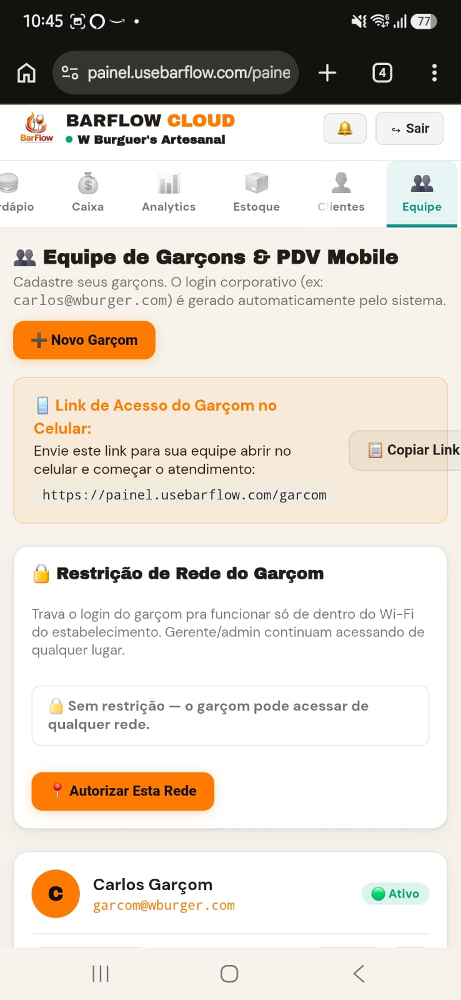
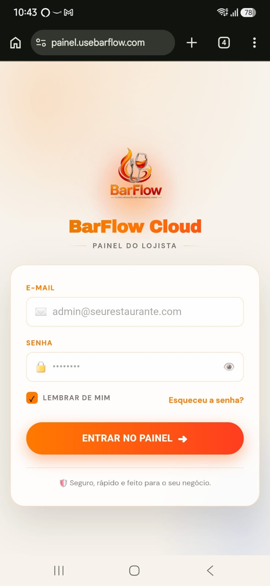
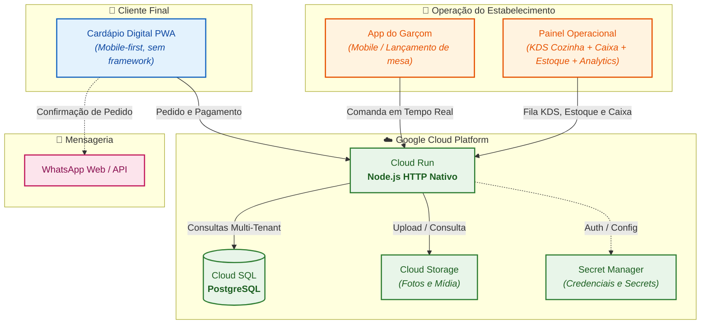

<div align="center">

# 🔥 BarFlow Cloud
### *SaaS Multi-Tenant de Gestão Operacional para Bares e Restaurantes*

[](https://nodejs.org/)
[](https://www.postgresql.org/)
[](https://cloud.google.com/)
[](https://www.docker.com/)
[-brightgreen?style=for-the-badge)](excerpts/multiTenantIsolation.test.js)
[]()

<p align="center">
  Cardápio digital PWA • Comanda mobile do garçom • KDS de cozinha em tempo real • Fechamento contábil de caixa • Controle de estoque • Analytics & SuperAdmin
</p>

---

### ⏱️ **Do zero à produção real em 3 dias** (28 a 30 de agosto de 2026)
*Construído sozinho e operando com cliente pagante real e fluxo financeiro diário ativo.*

</div>

<br/>

> [!NOTE]
> **Sobre este repositório:** Esta é uma **vitrine técnica curada** (case study + trechos de código representativos). O código-fonte integral é mantido privado por conter regras de negócio e dados operacionais de clientes em produção.

---

## 📸 Galeria de Telas da Aplicação em Produção

<table>
  <tr>
    <td width="50%" align="center">
      <b>📱 Cardápio Digital (PWA Cliente)</b><br/>
      <sub>Seleção rápida, opcionais customizados e checkout ágil</sub><br/><br/>
      
    </td>
    <td width="50%" align="center">
      <b>🧑‍🍳 KDS Cozinha (Tempo Real)</b><br/>
      <sub>Esteira dinâmica de preparo com separação de bebidas/cozinha</sub><br/><br/>
      
    </td>
  </tr>
  <tr>
    <td width="50%" align="center">
      <b>🤵 Painel do Garçom / Mesas</b><br/>
      <sub>Lançamento rápido por mesa, comanda e segurança por senha</sub><br/><br/>
      
    </td>
    <td width="50%" align="center">
      <b>💰 Controle & Fechamento de Caixa</b><br/>
      <sub>Abertura com troco, sangrias, suprimentos e conferência do dia</sub><br/><br/>
      
    </td>
  </tr>
  <tr>
    <td width="50%" align="center">
      <b>📈 Painel de Analytics & Faturamento</b><br/>
      <sub>Visão de faturamento, ticket médio e formas de pagamento</sub><br/><br/>
      
    </td>
    <td width="50%" align="center">
      <b>📦 Gestão de Estoque</b><br/>
      <sub>Controle de insumos, alertas de estoque baixo e movimentações</sub><br/><br/>
      
    </td>
  </tr>
  <tr>
    <td width="50%" align="center">
      <b>👥 Gestão de Equipe & Permissões</b><br/>
      <sub>Controle de acessos e papéis operacionais (garçom, gerente, dono)</sub><br/><br/>
      
    </td>
    <td width="50%" align="center">
      <b>🔐 Autenticação & Acesso Seguro</b><br/>
      <sub>Login isolado por tenant com rate-limit e proteção contra força bruta</sub><br/><br/>
      
    </td>
  </tr>
</table>

---

## 📊 Métricas & Destaques de Engenharia

| Métrica | Valor | Detalhes |
|---|---|---|
| ⏱️ **Tempo de Construção** | **3 dias** | Do primeiro commit ao primeiro pedido pago em produção |
| 🛡️ **Multi-Tenancy** | **100% Isolado** | Isolamento por `loja_id` validado com testes de ataque simulado |
| ⚡ **Stack Zero-Bloat** | **HTTP Nativo** | Sem Express/Fastify — imagens Docker leves e cold start instantâneo |
| 🧪 **Cobertura de Testes** | **54 testes nativos** | Executados via `node --test` contra PostgreSQL descartável (Docker) |
| 💰 **Validação** | **Cliente Real** | Restaurante em operação comercial diária com dinheiro real no caixa |

---

## 🧭 O Problema vs. A Solução

```
  ❌ CENÁRIO TRADICIONAL                    ✅ COM BARFLOW CLOUD
┌──────────────────────────────┐        ┌───────────────────────────────────┐
│ • Comandas de papel perdidas │        │ • Cardápio PWA rápido no celular  │
│ • Pedidos via WhatsApp soltos│  ───▶  │ • Garçom lança direto na mesa    │
│ • Cozinha desorganizada      │        │ • KDS em tempo real na cozinha    │
│ • Caixa não bate no fim do dia│       │ • Caixa blindado com dia de corte │
└──────────────────────────────┘        └───────────────────────────────────┘
```

Bares e restaurantes pequenos no Brasil costumam operar com anotações em papel, WhatsApp e planilhas — ou pagam caro por sistemas legados e engessados. O **BarFlow Cloud** funciona como o sistema operacional central da loja física: o cliente pede pelo celular, o garçom lança na mesa, a cozinha visualiza a esteira em tempo real e o dono fecha o caixa com precisão contábil.

---

## 🏗️ Arquitetura do Sistema



Um único serviço Node.js (servidor HTTP nativo, sem Express) atende três frontends diferentes — cardápio público, app do garçom e painel do lojista — todos multi-tenant sobre a mesma base PostgreSQL, isolados por `loja_id` em toda consulta.

---

## 🛠️ Stack & Decisões Técnicas

| Camada | Tecnologia | Motivação & Decisão de Engenharia |
|---|---|---|
| **Backend** | **Node.js (`http` nativo)** | Zero dependências pesadas; cold start instantâneo no Cloud Run e imagem Docker ultra-reduzida. |
| **Banco de Dados** | **PostgreSQL (Google Cloud SQL)** | Consistência ACID rigorosa para fechamento de caixa, transações e queries relacionais seguras. |
| **Frontend** | **Vanilla JS (PWA Mobile-First)** | Performance máxima em redes móveis 3G/4G, sem overhead de bundles pesados (React/Vue). |
| **Infraestrutura** | **Google Cloud Platform** | Serverless elástico com Cloud Run, Cloud Storage, Secret Manager e Artifact Registry. |
| **Testes** | **`node:test` + Test Containers** | Execução rápida de 54 testes sem Jest/Mocha, usando instâncias isoladas de PostgreSQL no Docker. |
| **Deploy** | **Docker + Cloud Run** | Pipeline de deploy automatizado via `gcloud` com zero downtime. |

---

## ✨ Funcionalidades

- 📱 **Cardápio Digital Público:** PWA responsivo com carrinho, adicionais por item, opções obrigatórias customizáveis (ex: ponto da carne, tipo de queijo) e envio de confirmação para o WhatsApp da loja.
- 🤵 **App do Garçom (Mobile-First):** Lançamento de pedidos direto na mesa com controle de comanda e exigência de senha de gerente para cancelamentos e estornos.
- 🧑‍🍳 **KDS (Kitchen Display System) em Tempo Real:** Fila inteligente que direciona pedidos para a cozinha assim que confirmados, com separação automática de itens que não exigem preparo (bebidas).
- 💰 **Controle Contábil de Caixa:** Abertura com troco inicial, suprimento, sangria, fechamento com conferência e trava no banco contra dupla abertura no mesmo dia de operação.
- 📦 **Gestão de Estoque:** Controle de disponibilidade de itens do cardápio em tempo real e monitoramento de consumo.
- 👥 **Gestão de Equipe & Permissões:** Controle granular de funções operacionais (administrador, gerente, garçom, atendente).
- 🔍 **"Meus Pedidos":** Login simplificado apenas com o número de telefone (sem fricção de senha) para histórico de pedidos e recurso "pedir de novo".
- 📈 **Painel de Analytics:** Monitoramento de faturamento, ticket médio, ranking de produtos mais vendidos e distribuição por método de pagamento.
- 👑 **Painel SuperAdmin:** Gestão consolidada de todas as lojas contratantes, controle de MRR e bloqueio automático por inadimplência.

---

## 🧩 Desafios de Engenharia Resolvidos (War Stories)

Uma seleção de problemas reais encontrados e solucionados durante o desenvolvimento e a operação em produção:

### 1. 🛡️ Isolamento Multi-Tenant Testado com Ataque Real
> *Em vez de apenas confiar em code review, foi criado um teste automatizado de invasão.*
- **O Desafio:** Garantir que um lojista jamais consiga acessar, modificar ou apagar registros de outro tenant.
- **A Solução:** Um teste adversarial que faz login como o *Cliente A* e tenta forçar leitura/escrita de entidades pertencentes exclusivamente ao *Cliente B* em todas as rotas (cardápio, pedidos, caixa e analytics).
- 📄 **Código:** [`excerpts/multiTenantIsolation.test.js`](excerpts/multiTenantIsolation.test.js)

### 2. ⏰ Fuso Horário Brasil vs. UTC no "Dia Operacional" de Bar
> *Bares e casas noturnas fecham às 4h ou 6h da manhã seguinte, não à meia-noite.*
- **O Desafio:** No Cloud Run o processo roda em UTC, enquanto o bar opera em Brasília (UTC-3). O corte configurado para 6h da manhã acabava disparando às 3h da manhã locais.
- **A Solução:** Implementação da função `getDataOperacao(horaCorte)` com deslocamento UTC-3 fixo e cálculo estrito no servidor (o frontend nunca define a data contábil de operação).
- 📄 **Código:** [`excerpts/caixaService.js`](excerpts/caixaService.js)

### 3. 🌐 Rate-Limit Dedicado por Rota vs. NAT de Wi-Fi Físico
> *Em bares físicos, clientes e funcionários costumam compartilhar o mesmo IP público via Wi-Fi.*
- **O Desafio:** Um rate-limit genérico bloqueava a conta administrativa do dono da loja após picos de consultas públicas de cardápio feitas pelos clientes no mesmo Wi-Fi.
- **A Solução:** Separação estrita dos limitadores e janelas de tráfego entre a rota pública de consulta de pedidos e a rota de login administrativo.
- 📄 **Código:** [`excerpts/rateLimit.js`](excerpts/rateLimit.js)

### 4. 🪲 Corrupção de Dados com `ON CONFLICT DO NOTHING` sem Constraint
- **O Desafio:** O PostgreSQL permite sintaticamente o uso de `ON CONFLICT DO NOTHING`, mas sem uma constraint `UNIQUE` correspondente a cláusula se torna um no-op silencioso, duplicando o estoque padrão a cada deploy.
- **A Solução:** Deduplicação via migration transacional e criação da constraint `UNIQUE` no banco sem downtime.

### 5. 📲 User Gesture em Redirecionamento do WhatsApp Mobile
- **O Desafio:** Um bug que só ocorria no aplicativo móvel (e nunca no navegador desktop) causava falha ao tentar abrir o app do WhatsApp por redirecionamento assíncrono.
- **A Solução:** O sistema operacional móvel exige um *User Gesture* explícito; corrigido substituindo a transição programática por uma ação direta disparada pelo toque do usuário.

---

## 🧪 Testes Automatizados

Suíte com **54 testes automatizados** executados diretamente pelo test runner nativo do Node.js:

```bash
# Execução da suíte de testes contra container descartável PostgreSQL
node --test
```

**Escopo de cobertura:**
- [x] Autenticação segura, hashes e expiração de sessão
- [x] Rate-limiting contra ataques de força bruta
- [x] Criação de pedidos com validação e recálculo de preço no backend
- [x] Idempotência de transações
- [x] Ciclo completo de caixa (abertura, sangria, suprimento e fechamento)
- [x] Testes de ataque e isolamento multi-tenant

---

## 📅 Linha do Tempo Real (28 a 30 de agosto de 2026)

| Período | Marcos de Entrega |
|---|---|
| **Dia 1** | Arquitetura multi-tenant, autenticação, cardápio digital, upload de fotos com deduplicação e configuração de domínio próprio. |
| **Dia 2** | Comanda mobile do garçom, controle de mesas, esteira KDS em tempo real, fechamento contábil de caixa e analytics. |
| **Dia 3** | Auditoria de segurança, mitigação de XSS/credenciais, testes de ataque multi-tenant, suíte de 54 testes e **deploy oficial em produção para o primeiro cliente pagante**. |

---

## 👤 Autor

<table align="center">
  <tr>
    <td align="center">
      <b>Idarlan Magalhães</b><br/>
      <i>Desenvolvedor de Software • IA, Automação & Arquitetura Web</i>
      <br/><br/>
      <a href="https://github.com/idarlandias">
        
      </a>
      <a href="https://www.linkedin.com/in/idarlandias/">
        
      </a>
    </td>
  </tr>
</table>

---

<div align="center">
  <sub>Construído com foco em simplicidade, segurança e alta performance operacional.</sub>
</div>
